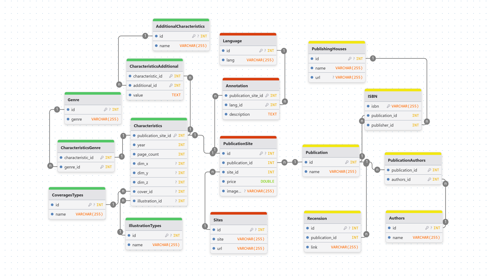
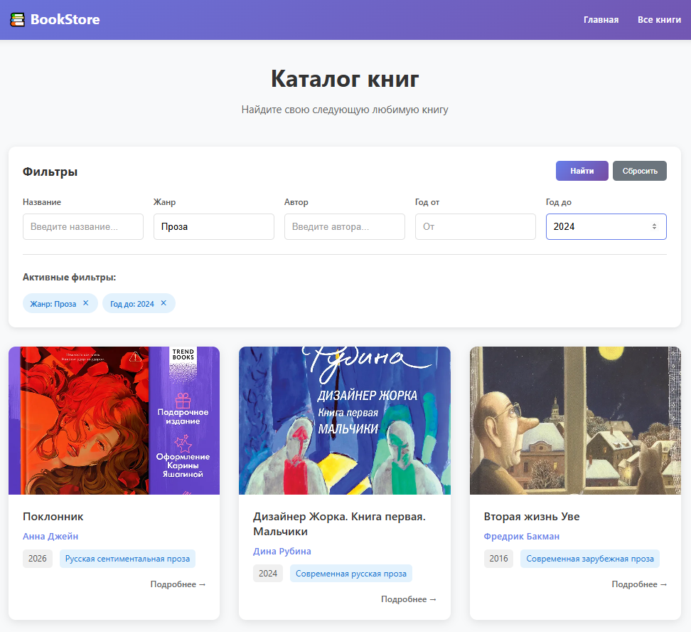
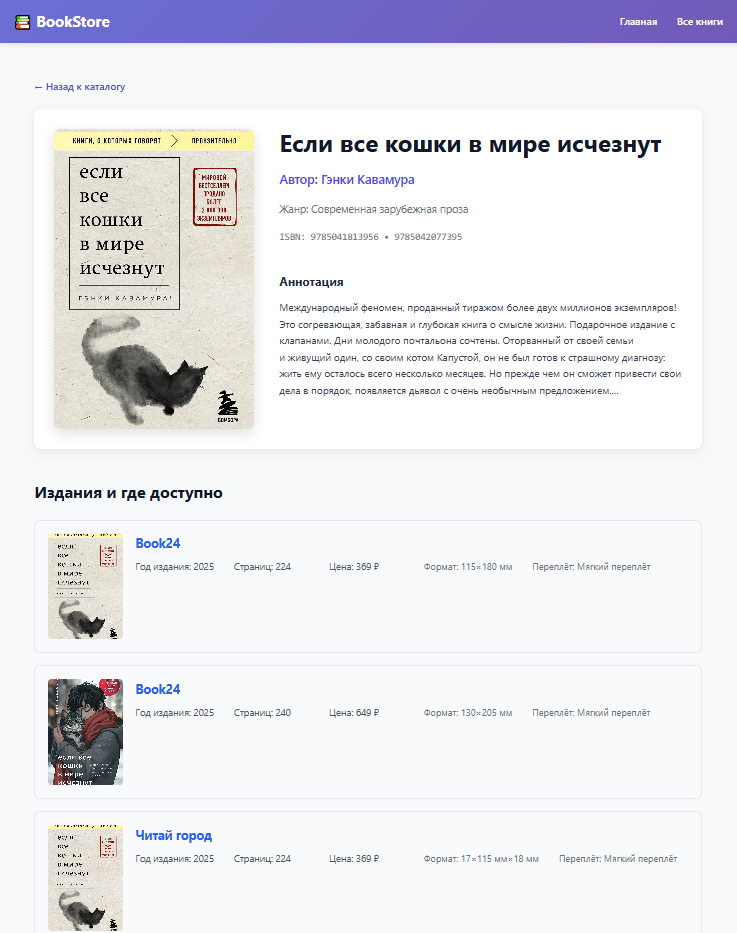

# Курсовой проект: «Разработка интеграционной базы данных на основе парсинга веб-ресурсов»

## Задание

[Ссылка на текст задания](./docs/spec.md)

## Установка и запуск

Скачиваем с гитхаба

```bash
git clone https://github.com/VL1507/book-data-integration.git
```

Заходим в папку с проектом

```bash
cd book-data-integration
```

Запускаем сайт

```bash
docker compose --profile site up --build -d
```

## Что было реализовано

### Парсер

Проходит по страницам с книгами, переходит на страницы книг, собирает информацию о них и сохраняет в json

Технологии

- Python 3.13
- Scrapy 2.13.4

Сайты

- [Book24](https://book24.ru/)
- [Лабиринт](https://www.labirint.ru/)
- [Читай-город](https://www.chitai-gorod.ru/)

### Загрузчик данных

Берет собранные парсером данные данные из json и загружает в БД

Технологии

- Python 3.11
- SQLAlchemy 2.0.41

Запуск

```bash
docker compose --profile data-loader up --build -d
```

### Дедупликатор

Работает в три этапа

- очистка
- постройка метафонов
- дедупликация

Технологии

- Python 3.11
- SQLAlchemy 2.0.41
- fonetika 1.5.0

Запуск

```bash
docker compose --profile deduplicator up --build -d
```

### База данных

Образ: mysql:8.0.16

Схема


### Бэкенд

Ручки

- /ping - проверка работоспособности
- /books/{publication_id} - данные книги по ее publication_id
- /books/ - список книг, принимает параметры для фильтрации

Технологии

- Python 3.11
- FastAPI 0.116.1
- SQLAlchemy 2.0.41

Особенности

- доступ открыт только для докер сети (самому отправить запросы не получится)

### Фронтенд

Работает через nginx

Технологии

- axios 1.13.2
- pinia 3.0.4
- vue 3.5.22
- vue-router 4.6.3

Главная страница


Страница с фильтрами


Страница книги

